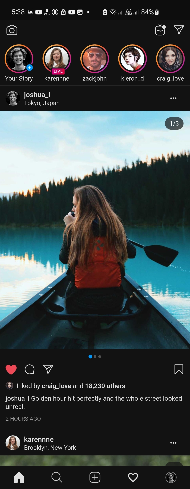

# Instagram Home Feed Replica

A polished Flutter recreation of the Instagram home feed focused on visual fidelity, smooth scrolling, reusable UI primitives, and testable architecture.

## Preview

- App video: [Watch demo](https://drive.google.com/file/d/1ZFUw5FmN1x_VbbW1p5fcxTXPyIlzwoMb/view?usp=sharing)



## What This Project Includes

- Instagram-style home feed with top bar, stories tray, post feed, and bottom navigation
- Shimmer-first loading flow with a mocked `1.5s` repository delay
- Infinite scrolling with lazy pagination
- Multi-image carousel posts with synced page indicators
- Pinch-to-zoom media interaction with overlay presentation
- Local Like/Save toggle interactions
- Cached remote images with graceful fallback UI
- Light and dark theme support
- Widget, bloc, unit, and integration/performance tests

## Project Structure

The codebase follows a feature-first structure with shared UI building blocks:

```text
lib/
├── app/        # App bootstrap, dependency wiring, app-level shell setup
├── core/       # Theme, constants, low-level shared widgets/utilities
├── shared/     # Reusable design-system widgets and tokens
└── features/
    └── feed/
        ├── data/         # Repository + mock service
        ├── domain/       # Models, failures, use cases
        └── presentation/ # Bloc, mappers, screens, widgets
```

## State Management

This project uses `flutter_bloc`.

`Bloc` was chosen because it keeps asynchronous flows explicit and easy to reason about: initial loading, pagination, failure handling, and Like/Save mutations all move through clear events and state transitions. At the same time, very high-frequency visual state such as carousel page position and pinch-to-zoom progress stays local to widgets, which helps reduce unnecessary rebuilds and keeps scrolling and gestures smoother.

## Tech Stack

- `flutter_bloc` for state management
- `equatable` for predictable state comparisons
- `cached_network_image` for network image caching
- `shimmer` for loading skeletons
- `flutter_svg` for vector asset rendering
- `font_awesome_flutter` for icon support

## Running the App

### Prerequisites

- Flutter SDK installed
- An emulator, simulator, or physical device connected

### Install dependencies

```bash
flutter pub get
```

### Run in debug mode

```bash
flutter run
```

### Run in profile mode

```bash
flutter run --profile
```

## Testing

### Unit and widget tests

```bash
flutter test
```

### Integration/performance test

```bash
flutter drive --profile --no-dds --driver=test_driver/integration_test.dart --target=integration_test/feed_performance_test.dart -d <device-id>
```

Notes:

- `--no-dds` is used because the performance suite collects timeline data.
- Replace `<device-id>` with your emulator or device id from `flutter devices`.

## Assets

- Vector assets are stored in `assets/vectors/`
- README preview image is stored in `screenshots/home-feed.jpg`
- Post and avatar media are loaded from public network URLs rather than bundled raster assets
